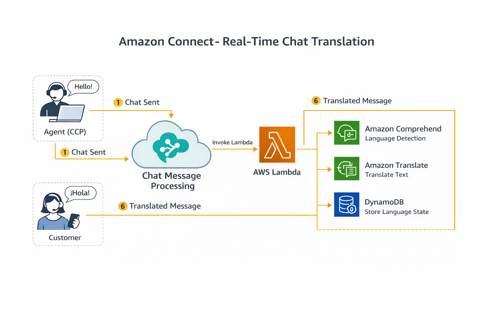
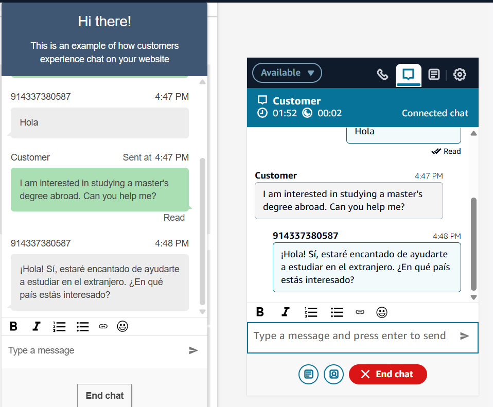
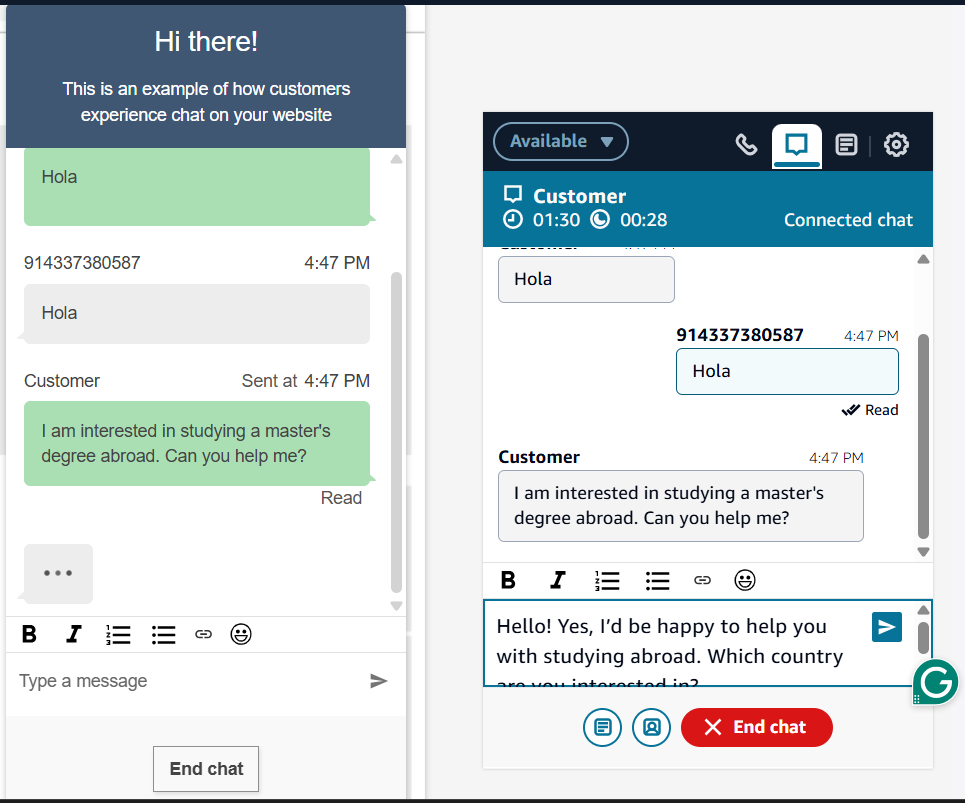

# Amazon Connect – Real-Time Chat Translation

This project implements **real-time chat translation** for **Amazon Connect Chat** using
**AWS Lambda**, **Amazon Translate**, and **Amazon Comprehend**.

The solution works with the **standard Amazon Connect CCP**
and **does not require any custom UI**.

---

##  Features

- Automatic language detection (customer & agent)
- Real-time translation of chat messages
- Works with default Amazon Connect CCP
- Serverless and scalable
- Infrastructure as Code (CloudFormation)
- Safe fallback if translation fails

---
##  Architecture Overview

**Flow summary:**
1. Customer or Agent sends a chat message
2. Amazon Connect invokes Lambda via *Chat Message Processing*
3. Lambda detects language using Amazon Comprehend
4. Lambda translates text using Amazon Translate
5. Translated message is delivered in real time

---
## Prerequisites

- AWS Account
- Amazon Connect instance (Chat enabled)
- AWS CLI configured
- Permissions to create:
  - Lambda
  - DynamoDB
  - IAM roles
  - CloudFormation stacks

---

## 🛠 Deployment Steps

### Step 1: Deploy Infrastructure

Deploy the CloudFormation stack:

### Step 2 : Import Amazon Connect Chat Flow
- Open Amazon Connect Console
- Go to Routing → Contact Flows
- Click Create contact flow
- Choose Import flow (JSON)
- Upload: connect/chat-contact-flow.json
### Step 3: Configure Contact Flow
- Inside the imported Chat Contact Flow:
- Open Set recording & analytics behavior
- Enable Chat message processing
- Select the deployed Lambda function
- Save and publish the flow
## Testing
- Start a chat as a customer
- Send a message in any language
- Agent should see the translated message
- Agent replies in their language
- Customer receives translated reply

## Chat Demo Screenshot

## 📄 License

This project is licensed under the **MIT License**.
